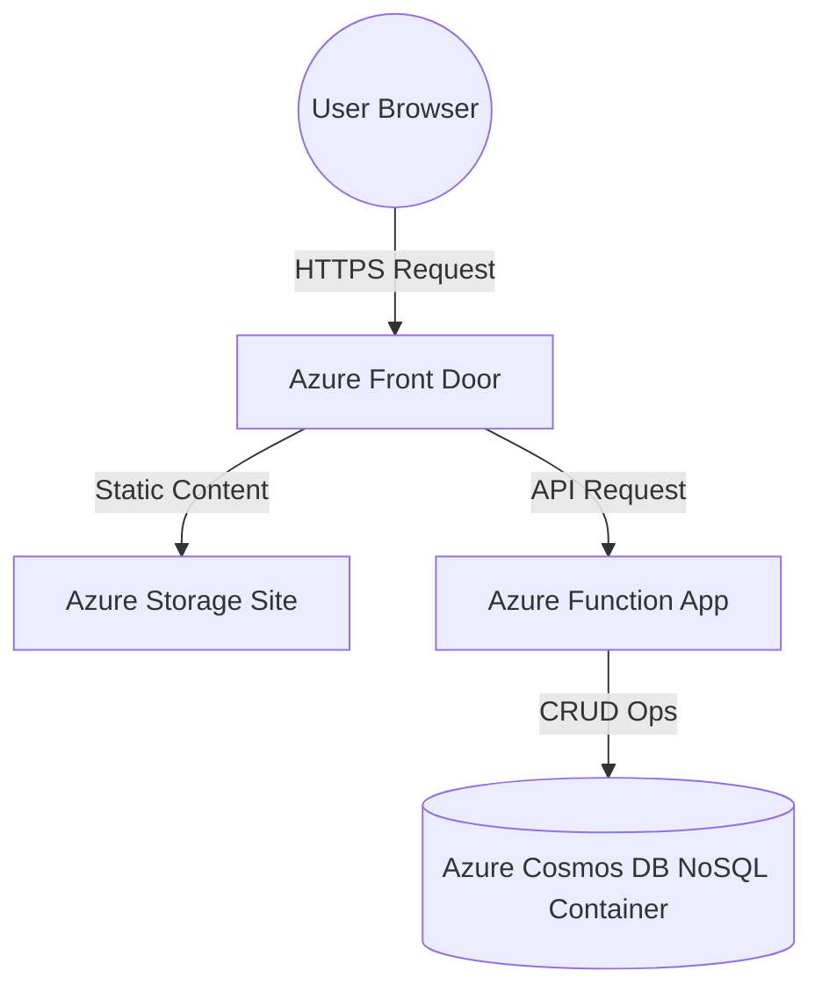

# The Cloud Resume Challenge: My One-Month Journey Through Azure
*A hybrid README + personal journal of how I stumbled (and occasionally sprinted) through Azure.*

[](https://azure.microsoft.com/)
[](https://www.python.org/)
[](https://developer.mozilla.org/en-US/docs/Web/JavaScript)
[](https://developer.mozilla.org/en-US/docs/Web/HTML)
[](https://developer.mozilla.org/en-US/docs/Web/CSS)
[](https://git-scm.com/)
[](https://github.com/)
[](https://code.visualstudio.com/)
[](https://www.terraform.io/)
[](https://learn.microsoft.com/en-us/azure/azure-resource-manager/bicep/)

ChatGPT recommended I add the tags above, aren't they neat?

## About Me

I come from a *recreationally technical* background. Ever since a friend of mine gave me an Ubuntu install CD in middle school, I was immediately drawn to the CLI (and wobbly windows), and inevitably became family tech support. Professionally, I’ve been in tech sales, slowly inching closer to the development and cloud side through RFPs, risk assessments, and compliance work.

This project was my first structured leap into Azure and hands-on cloud engineering. My goal wasn’t just to complete the Cloud Resume Challenge, it was to see whether I actually enjoyed “getting into the weeds.”

**Spoiler:** I did.

## Architecture Overview
Look at this neat Mermaid diagram ChatGPT taught me how to make to visualize the project!



## The Journal, Step by Step
A chronological walkthrough of what I built, what I broke, and what I learned.

### Step 1: AZ-900 Certification
Pretty straightforward. I used O’Reilly Learning (Jim Cheshire’s course) and Microsoft practice exams until I was consistently scoring 90%+, then booked the test. There were a few surprises on the test, but nothing too out-of-left-field.

Passed with an 857.

> [!TIP]
Don’t rely too heavily on practice exam formats. The live exam questions can look quite different in structure.

### Step 2: HTML
I “cheated” a bit. I’ve brushed against HTML before, but this time I leveraged ChatGPT to speed through layout and structure.
> [!TIP]
If you aren't a front-end dev, AI or templates can help you save you time here.

### Step 3: CSS
Same as Step 2 — ChatGPT helped me understand structure, responsiveness, and styling patterns enough to produce a clean static page.

### Step 4: Static Website
Dead simple: upload `index.html` and `style.css`, enable Static Website.
> [!TIP]
*Make sure your index document name matches your actual HTML file name.*
I uploaded `index.html` the first time and couldn’t figure out why nothing worked.

### HTTPS (Front Door)
This is where the adventure began.

The documentation recommended Azure CDN, but CDN Classic is deprecated. Front Door Standard/Premium is now the only method allowed, as far as I could tell.

I also learned the Azure free trial does not support Front Door.

Cue 30 minutes of subscription spelunking.

Then I remembered: I had $200 in free credits.

Crisis averted!

> [!IMPORTANT]
Front Door is **not cheap** (~$50 CAD/month). Plan to delete resources after testing or use a sandbox subscription. This becomes much easier once IaC is set up.

### Step 6: DNS
This took longer than I’d like to admit. I initially pointed my domain to the static website endpoint… and nothing.

Eventually I realized the Front Door endpoint is what actually matters.

> [!TIP]
Your CNAME target should be **the Front Door endpoint**, not the Blob Storage URL.

### Step 7: JavaScript
This is where the “real” challenge began.

I needed frontend JS to:

1. Trigger an increment via POST
2. Read the updated visitor count via GET
3. Display the count on page load

I learned about `DOMContentLoaded`, which felt like rediscovering StarCraft "use map settings" trigger logic from my teens.

> [!TIP]
`DOMContentLoaded` is the simplest reliable way to run code after your HTML finishes loading, instead of using something like a button to trigger visitor coutner updates.

### Step 8: Database
I first attempted using Cosmos DB's Table API but I encountered some difficulty figuring out how to match it to the Function App later on down the road, so I scrapped it and rebuilt everything in Cosmos DB's NoSQL.

I found the flexibility of NoSQL and JSON formatting to be easier to work with. Later on, I also discovered that the JSON format of NoSQL also easily supported scripted automation.

Here’s the JSON seed data I used:

```
{
  "id": "1",
  "count": 0
}
```
### Step 9: API
I chose Python, consumption plan, HTTP trigger.

But then Azure told me I must develop this via VSCode or GitHub — no inline editor allowed.

**Side Quest:** Learn VSCode + Git + Azure integration in one afternoon.

> [!NOTE]
This ended up being one of the most useful skills I gained during the entire challenge.

### Step 10: Python
This was the hardest step.

I had to:

- connect to Cosmos DB
- locate the right DB + container
- increment visitor count
- return a proper JSON result
- gracefully handle errors
- ensure JavaScript could parse everything

My first version was rough but functional, and the sense of victory was very real. I admittedly had a great deal of help from ChatGPT on this step.

**Side Quest:** Move to CLI deployment
VSCode deployments hung indefinitely (perhaps an issue with VSCode on Linux/Debian?), so I switched entirely to Azure CLI. Much faster. 

> [!TIP]
Deployment via `az functionapp deployment source config-zip` is rock solid and predictable.

### Step 11: Testing
Learned mocking, patching, and unit test structure in Python.

ChatGPT was… extremely helpful here.

### Step 12: Infrasructure as Code
This was my “aha” moment. After many manual deployments, IaC suddenly made so much sense.

- Started with ARM Templates
- Discovered the VSCode ARM extension was deprecated
- Switched to Bicep
- Then later rewrote everything in Terraform

Both repos available here:

**Bicep:** https://github.com/dalenfree/azure-resume-challenge-bicep

**Terraform:** https://github.com/dalenfree/azure-resume-challenge-terraform

### Step 13: Source Control
From Step 9 onward, Git became mandatory.

VSCode's Git integration is good, but I preferred using a bash terminal to run Git commands.

> [!TIP]
Deploying directly from VSCode to Azure is slow on Linux. Use CLI or GitHub Actions instead.

### Step 14: CI/CD (Backend)
This was *so* satisfying once it finally worked.

I used:
- GitHub Actions
- Entra ID federated credentials
- Azure CLI login in workflows

> [!IMPORTANT]
If your whole project lives in one repo, always use:
>
>`on: push: paths:`
>
>Without this, your backend workflow will redeploy every time you commit anything anywhere.

### Step 15: CI/CD (Frontend)
Similar setup to the backend, but using blob upload steps, static site config, and a Front Door purge at the end.

> [!TIP]
Add `--nowait` to your purge command.
For some reason the purge step hangs for 30+ minutes without it.

### Step 16: Blog Post / Reflection
Does this count?

Either way, documenting the journey forced me to articulate what I learned, what I struggled with, and what I want to explore next.

## Reflection
This project gave me:

- Real hands-on Azure experience
- The confidence to work with APIs, Functions, Cosmos DB
- A working understanding of IaC and CI/CD
- Enough Python + JavaScript foundations to build full-stack prototypes and API calls
- A clearer sense that cloud engineering is something I genuinely enjoy

## Next Steps
- Learn Azure App Services / Container Apps
- Continue building Terraform workflows
- Integrate more security concepts (managed identities, private networking)
- Build an IoT + Function App + Cosmos DB project?
- Improve frontend skills for more interactive projects